# Circles for Mac: User Manual

> **Draft.** This covers the macOS app as of M4.5 and M6 (October 2026). Screens and wording may still change. Most screenshots come from the app's UI test (`Apps/Apple/CirclesUITests`), which plays both people.

Circles is a social network with no server in the middle. Your identity, posts and contacts live on your Mac. Posts go directly to the people you share them with, encrypted for exactly that audience.

- [Getting started](#getting-started)
- [Adding people](#adding-people)
- [The Stream](#the-stream)
- [Posting](#posting)
- [Circles](#circles)
- [Communities](#communities)
- [Settings](#settings)
- [Staying reachable](#staying-reachable)

## Getting started

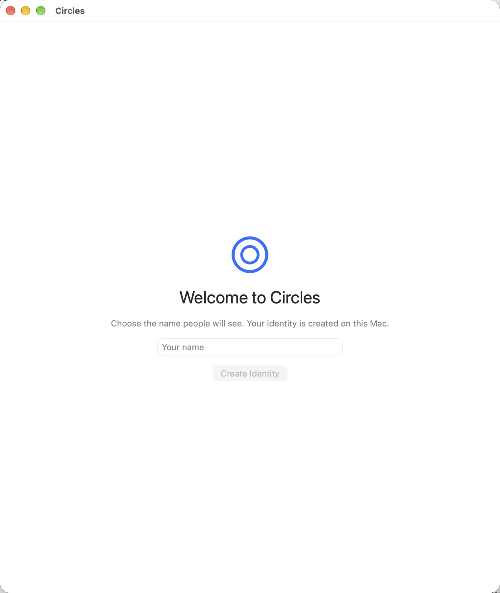

The first time you open Circles, choose the name people will see and click **Create Identity**. Your identity, a set of keys, is created on this Mac and never leaves it. Nobody signs you up anywhere.

The window has four sections in the sidebar: **Stream**, **People**, **Circles** and **Communities**. The line along the bottom shows whether you're online, for example `Online · port 56773 · synced just now`. Click the icon at its right to see network activity.

## Adding people

Two people can see each other's posts once each has added the other.

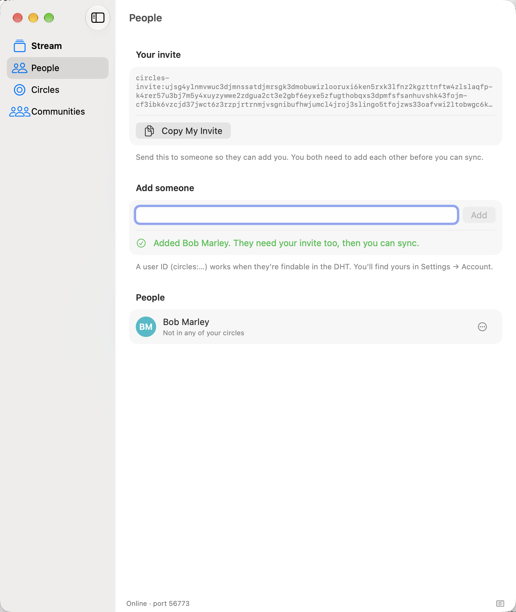

**With invites** (always works):

1. On **People**, click **Copy My Invite** and send the text (`circles-invite:…`) to the other person however you like: a message, an email, in person.
2. Paste the invite they send you into **Add someone** and click **Add**.

**With a user ID** (when they're findable in the DHT):

Paste their user ID (`circles:…`) instead of an invite. Circles looks them up in the DHT, the shared directory of where people can be found, and adds them. They find your user ID in **Settings → Account**, and they still need to add you back.

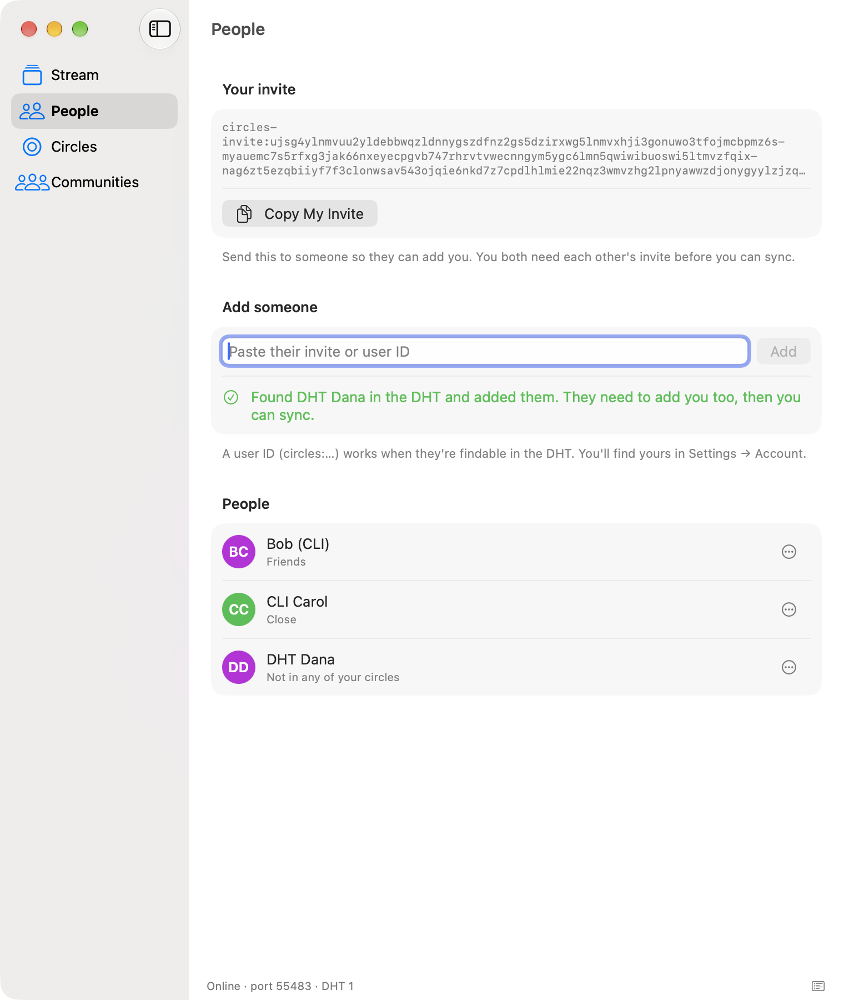

If they can't be found, ask them for an invite instead. See [The DHT](#the-dht) for when user IDs work.

**Managing contacts:** click the **…** next to someone to **Rename…** them (the name is only on your devices) or **Remove…** them. Removing someone takes them out of all your circles, and they can't see anything you post from then on.

## The Stream

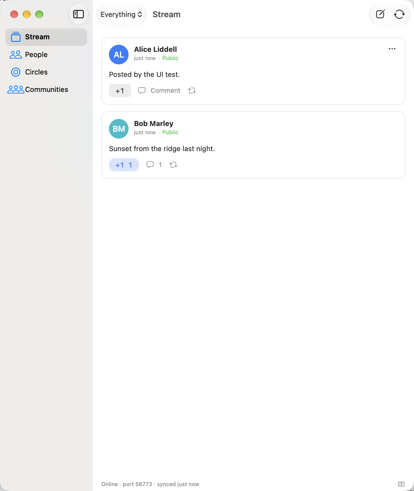

The Stream shows posts from you and your contacts, newest first. New posts appear by themselves as your Mac syncs. Click the sync button in the toolbar to sync straight away.

- **Show only one circle:** use the menu at the top left (**Everything**, or one of your circles).
- **+1** a post, or open it with **Comment**.
- **Reshare** a public post, publicly. You're asked to confirm, since everyone will be able to see your reshare.
- **Delete your own post** from the **…** on its card. It's removed for everyone, along with its comments and +1s, as they sync.

### Comments

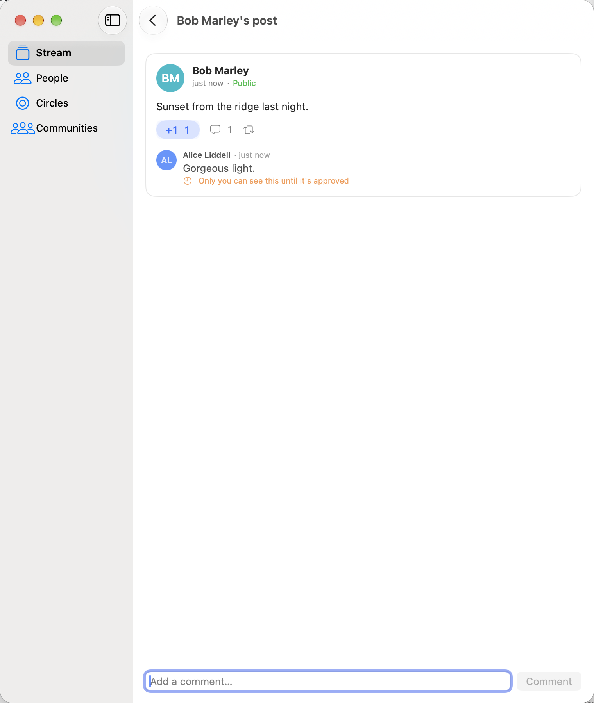

Click a post to open it, type in **Add a comment…** and click **Comment**.

A post's author decides which comments others see. Until the author's Mac approves your comment, it's marked *Only you can see this until it's approved*. The author's Mac approves comments from their contacts automatically when it next syncs, unless they turned comments off for that post.

On your own posts, you can take a comment out of the thread for everyone with **Remove Comment…** from its **…** menu.

When Circles isn't the active app, new posts and comments on your posts show up as notifications. Click one to open the post.

## Posting

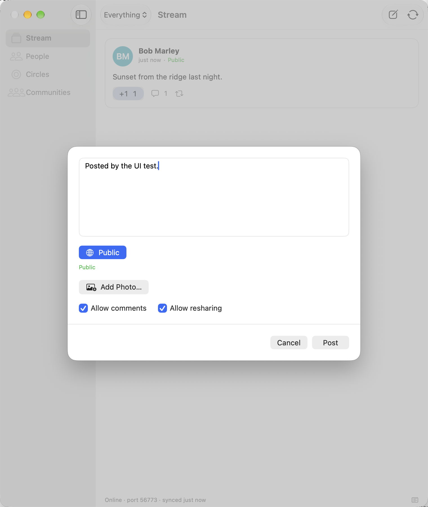

Click the compose button in the Stream's toolbar.

1. Write your post.
2. Choose who sees it: **Public**, or one or more of your circles. The line underneath sums up the audience.
3. Optionally, **Add Photo…**. Location data is stripped from photos before they're posted. Formats that can't be cleaned yet (such as some HEIC files) are converted to JPEG first.
4. Choose whether to **Allow comments** and **Allow resharing**, then click **Post**.

Public posts are readable by anyone who receives them. Posts to circles are encrypted so that only the people in those circles can read them.

## Circles

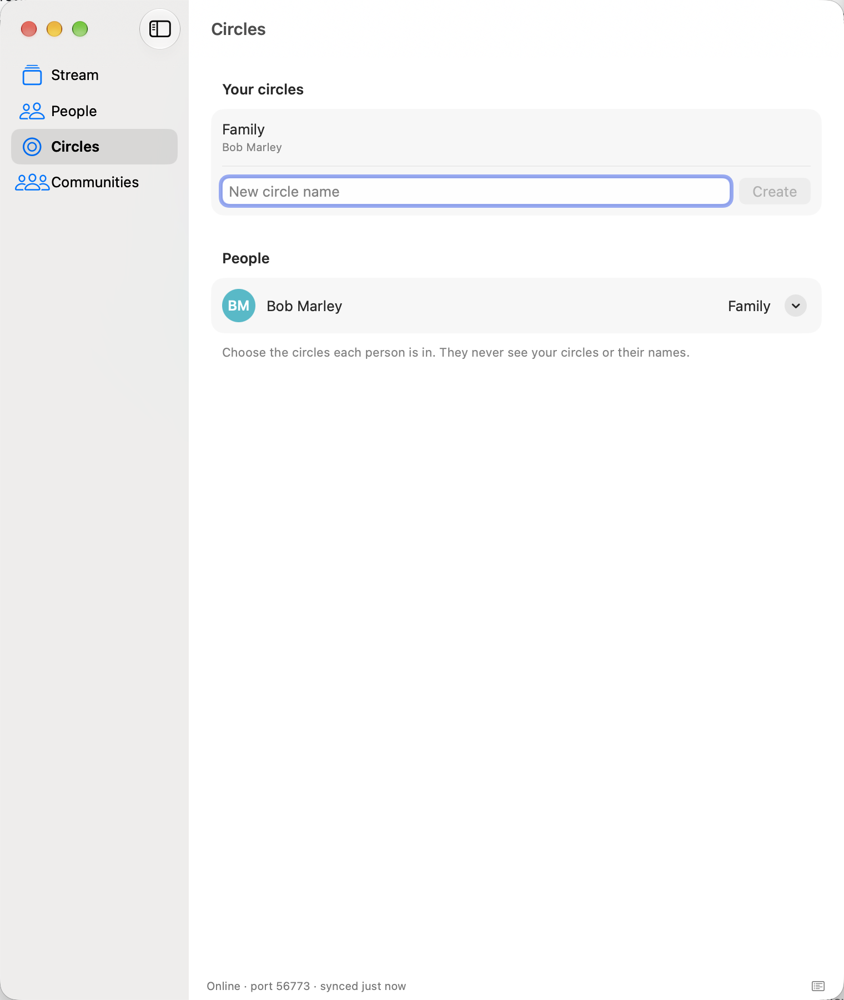

Circles are your private groupings of contacts, such as Family or Close friends.

- Type a name under **Your circles** and click **Create**.
- Under **People**, use the menu next to each contact to choose which circles they're in.

People never see your circles or their names. They only see the posts you share with them.

## Communities

Communities are groups that members post to together, owned by the person who created them.

### Creating a community

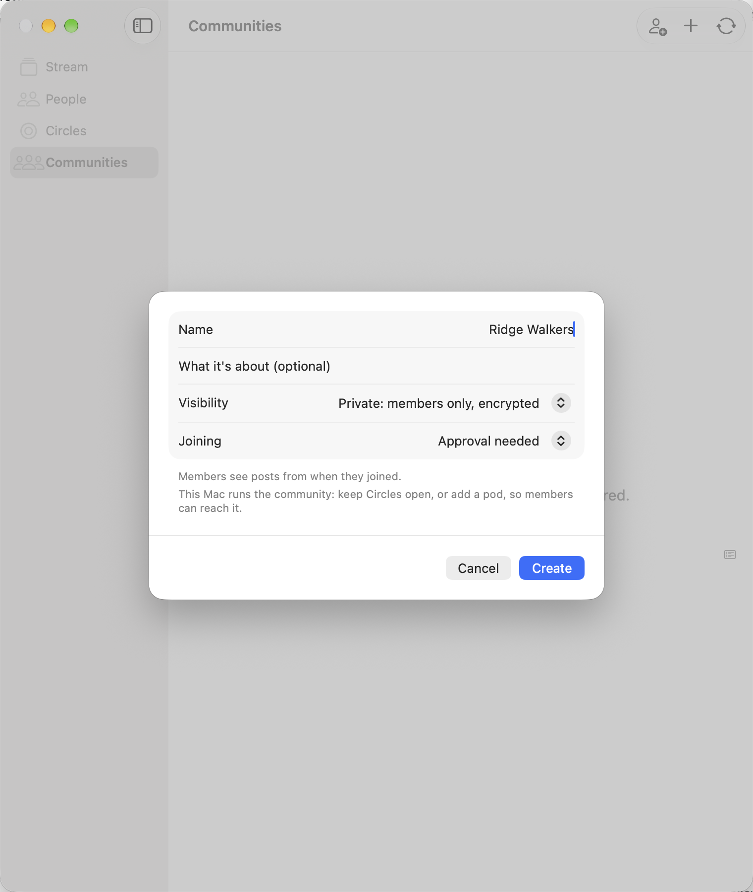

On **Communities**, click **+** (**New Community…**) and set:

- **Visibility:** *Private* (members only, encrypted) or *Public* (anyone can read).
- **Joining:** *Approval needed*, *Anyone can join*, or *Invite only*.

Members see posts from when they joined. Your Mac runs the community, so keep Circles open or [add a pod](#pods--relays) so members can reach it.

### Inviting and letting people in

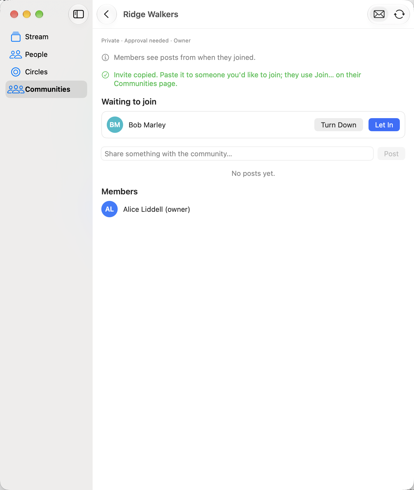

On the community's page, the envelope button copies an invite. The other person pastes it into **Join…** (the person-with-plus button on their Communities page) and clicks **Ask to Join**. Requests appear under **Waiting to join**, where the owner chooses **Let In** or **Turn Down**.

### Inside a community

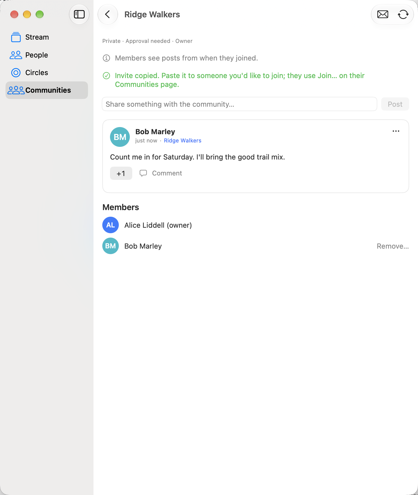

Members post with **Share something with the community…**, and can +1 and comment on posts. The owner can also:

- remove a post or comment from its **…** menu (it disappears for everyone once they sync);
- **Remove…** a member, who then stops receiving the community's posts. In a private community, they can't read anything posted afterwards.

## Settings

Open Settings with **⌘,**.

### Account

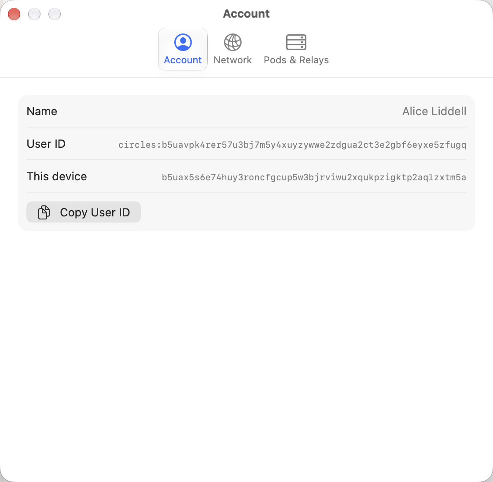

Your name, user ID and this device's ID. **Copy User ID** puts your user ID on the clipboard, for people adding you through the DHT.

### Network

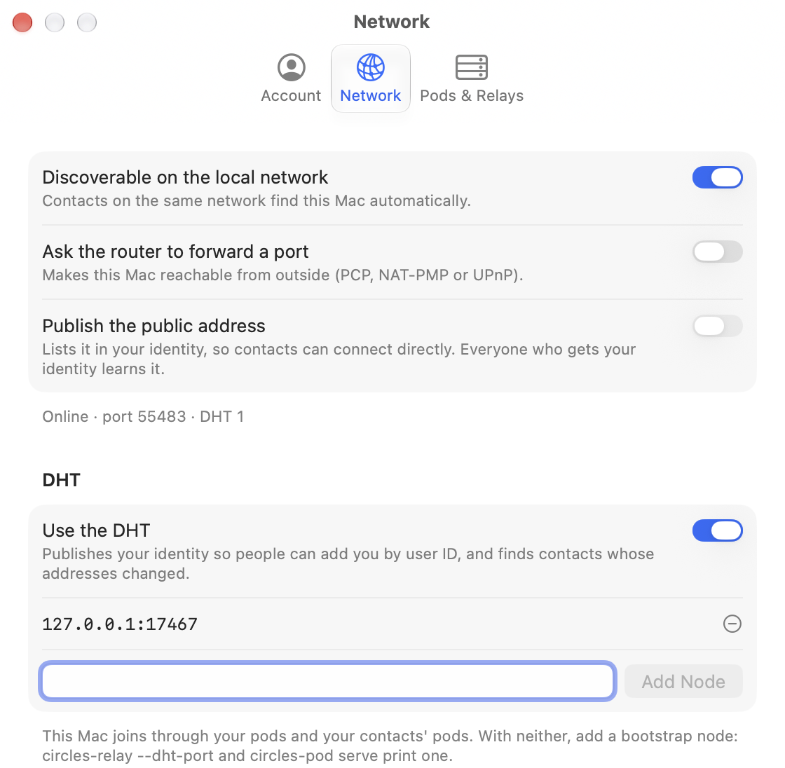

- **Discoverable on the local network:** contacts on the same network find this Mac automatically.
- **Ask the router to forward a port:** makes this Mac reachable from outside your network (PCP, NAT-PMP or UPnP), if your router allows it.
- **Publish the public address:** lists that address in your identity so contacts can connect directly. Everyone who gets your identity learns it.

#### The DHT

The DHT is a shared directory, run by the Circles network itself, of where each person can currently be found. It holds only signed identity information, never posts.

- **Use the DHT** (on by default) publishes your identity there. That lets people add you by user ID, and lets Circles find contacts whose addresses have changed.
- Your Mac joins the DHT through your pods and your contacts' pods. If you have neither, add a **bootstrap node**: paste a `circles-dht-node:…` address and click **Add Node**. A relay started with `--dht-port`, and any pod, prints one. Remove a node with the **⊖** next to it.

Once joined, the status line shows how many DHT nodes your Mac knows, for example `DHT 1`.

### Pods & Relays

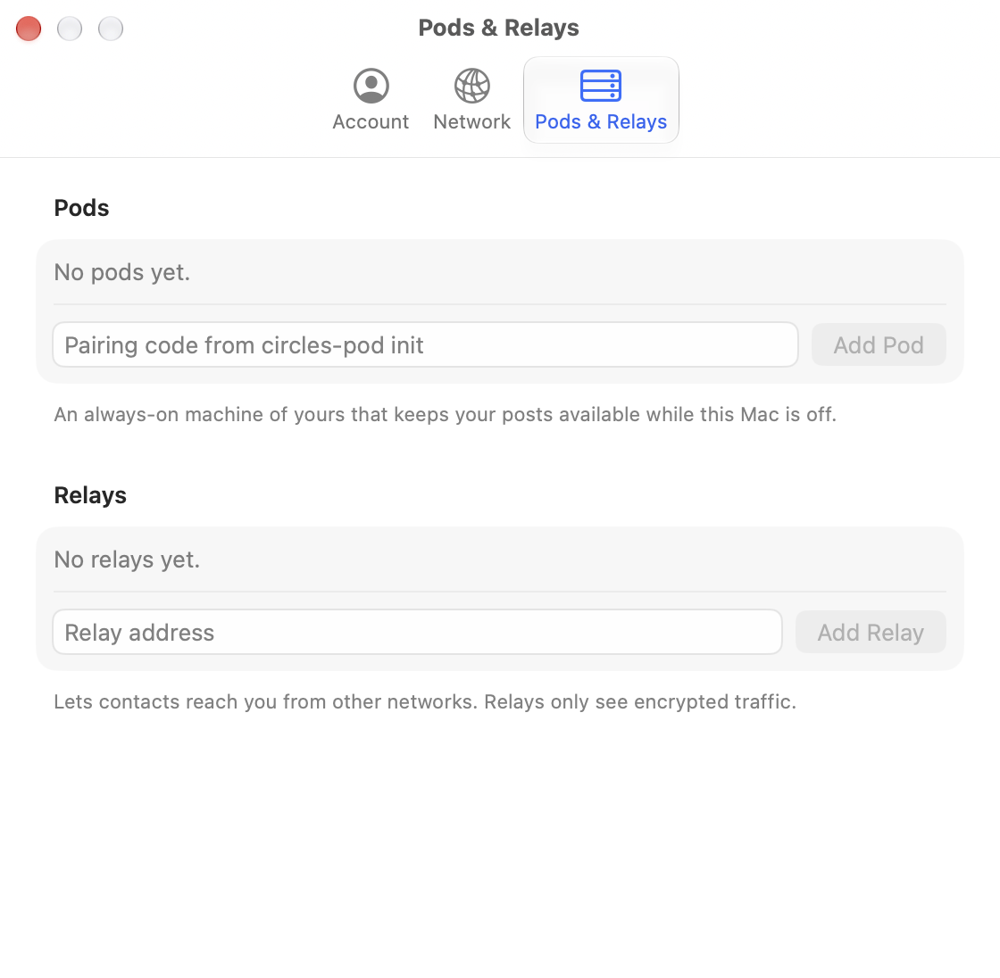

- **Pods** are always-on machines of yours, such as a home server or a small cloud machine, that keep your posts available while your Mac is off. Run `circles-pod init` on the pod, paste its pairing code here and click **Add Pod**. Then click **Copy Pairing Command** and run that command on the pod to finish pairing.
- **Relays** let contacts reach you from other networks when neither of you can accept connections directly. Paste a relay's address (`host:port#key`) and click **Add Relay**. Relays only see encrypted traffic.

## Staying reachable

Circles syncs whenever it can reach your contacts, so:

- **Keep Circles open** for posts to flow. It keeps syncing in the background and follows your Mac to sleep, wake and new networks.
- **On the same network**, contacts find each other automatically.
- **On different networks**, use a relay, router port forwarding, or a pod. A pod also keeps you reachable while your Mac is off, and keeps any communities you own running.
